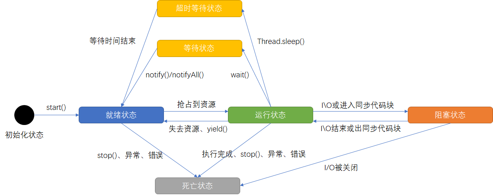
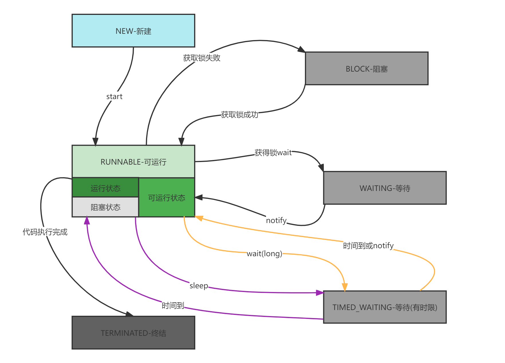
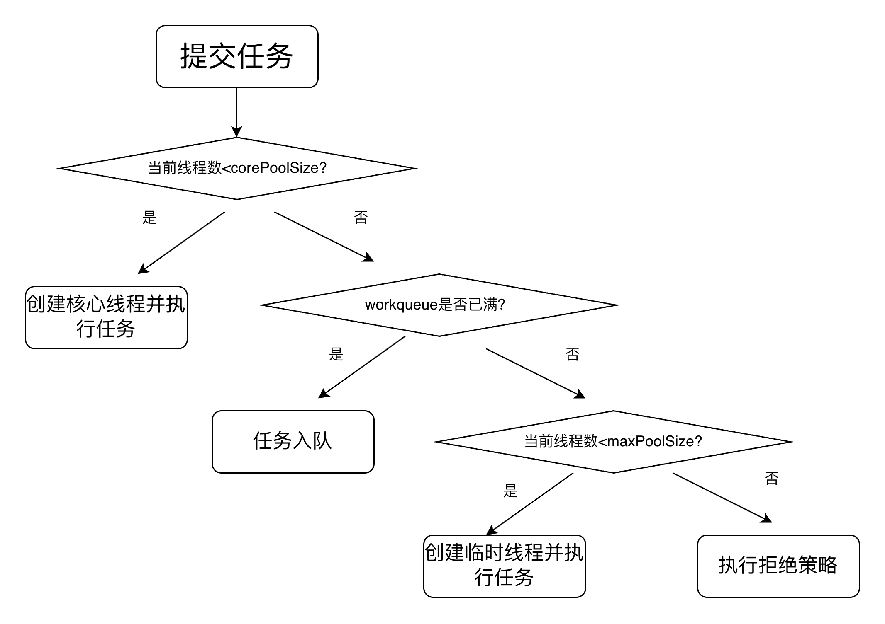

## 概述

多线程是指在一个程序中同时执行多个线程，每个线程都有自己独立的执行路径。在多线程中，程序的执行可以同时进行多个任务，从而提高系统的资源利用率和响应性能。

在传统的单线程编程模型中，程序按照顺序执行，一次只处理一个任务。这种方式在某些情况下可能会导致效率低下或者无法满足需求。而多线程通过将任务拆分为多个子任务，并且在不同的线程上同时执行，从而实现并发处理。

## 线程的状态

操作系统层面划分线程状态



java代码层面划分线程状态




## 四种创建线程的方式

### 继承 Thread 类

继承 Thread 类并重写 run() 方法，直接创建 Thread 子类对象并调用 start() 方法启动线程。

```java
@Slf4j
class MyThread extends Thread {
    public MyThread(String name) {
        super(name);  // 调用父类 Thread 的构造函数设置名称
    }
    @Override
    public void run() {
        for (int i = 0; i < 3; i++){
            log.info("Thread ：{}", i);
        }
    }
}

new MyThread("haibara").start();
```

### 实现 Runnable 接口

实现 Runnable 接口的 run() 方法，使用 Thread 类的构造函数传入 Runnable 对象，调用 start() 方法启动线程。

```java
@Slf4j
class MyRunnable implements Runnable {
    @Override
    public void run() {
        for (int i = 0; i < 3; i++){
            log.info("Runable ：{}", i);
        }
    }
}

new Thread(new MyRunnable(), "xudu").start();
```

### 使用 Callable 和 FutureTask

实现 Callable 接口的 call() 方法，使用 FutureTask 包装 Callable 对象，再通过 Thread 启动。

```java
@Slf4j
class MyCallable implements Callable<String> {
    @Override
    public String call() throws Exception {
        log.info("Callable hello");
        return "success";
    }
}

FutureTask<String> futureTask = new FutureTask<>(new MyCallable());

new Thread(futureTask, "yinuo").start();
```

### 使用自定义线程池 

```java
ThreadPoolExecutor poolExecutor = new ThreadPoolExecutor(
                2,
                4,
                30,
                TimeUnit.SECONDS,
                new ArrayBlockingQueue<>(10),
                new NamedThreadFactory("xudu"),
                new ThreadPoolExecutor.CallerRunsPolicy()
        );

        poolExecutor.execute(new MyRunnable());
        poolExecutor.shutdown();
```

```java
class NamedThreadFactory implements ThreadFactory {

    private final AtomicInteger index = new AtomicInteger(1);
    private final String prefix;

    public NamedThreadFactory(String prefix) {
        this.prefix = prefix;
    }

    @Override
    public Thread newThread(Runnable r) {
        Thread t = new Thread(r);
        t.setName(prefix + "-" + index.getAndIncrement());
        return t;
    }
}
```


Runnable vs Callable：

Runnable 的 run() 方法不返回结果，不能抛出检查异常；Callable 的 call() 方法可以返回结果，并允许抛出检查异常。使用 Callable 更适合需要返回结果或处理异常的并发任务。


Java语言支持多实现，一个类可以实现多个接口，因此可以更灵活地创建线程。

通过实现Runnable接口，可以将任务逻辑与线程的启动和管理逻辑分离，使代码更清晰、结构更合理。

Runnable对象可以作为参数传递给其他线程或线程池，实现更高级的线程管理和复用。


## 线程常用方法

- start()

  启动一个新线程，在新的线程运行 run 方法中的代码。start 方法只是让线程进入就绪，里面代码不一定立刻运行（CPU 的时间片还没分给它）。每个线程对象的start方法只能调用一次，如果调用了多次会出现IllegalThreadStateException

- run()

  新线程启动后会调用的方法。如果在构造 Thread 对象时传递了 Runnable 参数，则线程启动后会调用 Runnable 中的 run 方法，否则默认不执行任何操作。但可以创建 Thread 的子类对象，来覆盖默认行为

- join() / join(long n)

  等待线程运行结束

- getId()

  获取线程长整型的唯一 id

- getName() / setName(String)

  获取/修改 线程名

- getPriority() / setPriority(int)

  获取/修改 线程优先级。java中规定线程优先级是1~10 的整数，较大的优先级能提高该线程被 CPU 调度的机率

- getState()

  获取线程状态，NEW、RUNNABLE、BLOCKED、WAITING、TIMED_WAITING、TERMINATED

- isInterrupted()

  判断是否被打断， 不会清除打断标记

- isAlive()

  线程是否存活（还没有运行完毕）

- interrupt()

  打断线程，如果被打断线程正在 sleep，wait，join 会导致被打断的线程抛出 InterruptedException，并清除打断标记；如果打断的正在运行的线程，则会设置打断标记 ；park 的线程被打断，也会设置打断标记

- interrupted()

  判断当前线程是否被打断 ，会清除打断标记

- currentThread()

  获取当前正在执行的线程

- sleep(long n)

  让当前执行的线程休眠n毫秒，休眠时让出 cpu 的时间片给其它线程

- yield()

  提示线程调度器让出当前线程对CPU的使用，主要是为了测试和调试


## 线程安全问题

### 出现线程安全性问题的条件

1. 在多线程的环境下
2. 必须有共享资源
3. 对共享资源进行非原子性操作


### **解决线程安全性问题的方法**

- 针对多个线程操作同一共享资源——不共享资源（ThreadLocal、不共享、操作无状态化、不可变）
- 针对多个线程进行非原子性操作——将非原子性操作改成原子性操作（使用加锁机制来保证可见性和有序性以及原子性、使用JDK自带的原子性操作的类、JUC提供的相应的并发工具类）


### **性能问题**

1. 线程的生命周期开销非常高。在线程切换时存在CPU上下文切换开销，内存同步也存在着开销。
2. 消耗过多的CPU资源。如果可运行的线程数量多于可用处理器的数量，那么有线程将会被闲置。大量空闲的线程会占用许多内存，给垃圾回收器带来压力，而且大量的线程在竞争CPU资源时还将产生其他性能的开销。
3. 降低稳定性


什么是死锁？

两个或多个线程在执行过程中，因争夺资源而形成的一种相互等待的状态，若无外力干预，这些线程都将无法继续执行。

什么是活锁？

多个线程持续改变状态以响应对方的行为，但始终无法推进程序进展的一种状态。


## 线程同步

### synchronized的用法

修饰方法

修饰普通方法，相当于锁当前对象，调用者，即指 this对象

```java
public synchronized void method() {
  System.out.println("do something");
}
```

修饰静态方法，相当于锁当前类对象，也指 className.class

```java
public static synchronized void method() {
  log.info("do something");
}
```


修饰代码块【可以缩小锁的范围，提升性能】

锁普通对象和锁this

```java
public void method() {
  synchronized(this) {
    log.info("do something");
  }
}
```

锁定类对象className.class

```java
public void method() {
  synchronized(SynchronizedTest.class) {
    log.info("do something");
  }
}
```

### Lock 接口

常用实现：ReentrantLock

```java
Lock lock = new ReentrantLock();
lock.lock();
try {
    // 临界区
} finally {
    lock.unlock();
}
```


### 原子类

java 中的原子类是通过使用硬件提供的原子操作指令（如 CAS，Compare-And-Swap）来确保操作的原子性，从而避免线程竞争问题。

常用的原子类有以下几种：

1. AtomicInteger：用于操作整数的原子类，提供了原子性的自增、自减、加法等操作。
2. AtomicLong：与 AtomicInteger 类似，但用于操作 long 型数据。
3. AtomicBoolean：用于操作布尔值的原子类，提供了原子性的布尔值比较和设置操作。
4. AtomicReference：用于操作对象引用的原子类，支持对引用对象的原子更新。
5. AtomicStampedReference：在 AtomicReference 的基础上，增加了时间戳或版本号的比较，避免了 ABA 问题。
6. AtomicIntegerArray 和 AtomicLongArray：分别是 AtomicInteger 和 AtomicLong 的数组版本，提供了对数组中各个元素的原子操作。


### 并发工具类

#### CountDownLatch

作用： 一个线程（或多个）等待其他线程完成操作。

用法： 适用于主线程需要等待多个子线程完成任务的场景。

```java
CountDownLatch latch = new CountDownLatch(3);
Runnable task = () -> {
    try {
        // 执行任务
    } finally {
        latch.countDown(); // 任务完成，计数器减一
    }
};
new Thread(task).start();
new Thread(task).start();
new Thread(task).start();
latch.await(); // 等待所有任务完成
System.out.println("所有任务都完成了");
```


#### CyclicBarrier

作用：让一组线程到达一个共同的同步点，然后一起继续执行。常用于分阶段任务执行。

用法：适用于需要所有线程在某个点都完成后再继续的场景。

```java
CyclicBarrier barrier = new CyclicBarrier(3, () -> {
    System.out.println("所有线程都到达了屏障点");
});
Runnable task = () -> {
    try {
        // 执行任务
        barrier.await(); // 等待其他线程
    } catch (Exception e) {
        e.printStackTrace();
    }
};
new Thread(task).start();
new Thread(task).start();
new Thread(task).start();
```


#### Semaphore

作用： 控制访问资源的线程数，可以用来实现限流或访问控制。

用法： 在资源有限的情况下，控制同时访问的线程数量。

```java
Semaphore semaphore = new Semaphore(3);
try {
    semaphore.acquire(); // 获取许可
    // 执行任务
} finally {
    semaphore.release(); // 释放许可
}
```


#### BlockingQueue

作用： 是一个线程安全的队列，支持阻塞操作，适用于生产者-消费者模式。

用法： 生产者线程将元素放入队列，消费者线程从队列中取元素，队列为空时消费者线程阻塞。

```java
BlockingQueue<String> queue = new LinkedBlockingQueue<>();
Runnable producer = () -> {
    try {
        queue.put("item"); // 放入元素
    } catch (InterruptedException e) {
        e.printStackTrace();
    }
};
Runnable consumer = () -> {
    try {
        String item = queue.take(); // 取出元素
    } catch (InterruptedException e) {
        e.printStackTrace();
    }
};
new Thread(producer).start();
new Thread(consumer).start();
```


## 线程池

### 原理

线程池是一种池化技术，用于预先创建并管理一组线程，避免频繁创建和销毁线程的开销，提高性能和响应速度。

它几个关键的配置包括：核心线程数、最大线程数、空闲存活时间、工作队列、拒绝策略。

主要工作原理如下：

1. 默认情况下线程不会预创建，任务提交之后才会创建线程（不过设置 prestartAllCoreThreads 可以预创建核心线程）。
2. 当核心线程满了之后不会新建线程，而是把任务堆积到工作队列中。
3. 如果工作队列放不下了，然后才会新增线程，直至达到最大线程数。
4. 如果工作队列满了，然后也已经达到最大线程数了，这时候来任务会执行拒绝策略。
5. 如果线程空闲时间超过空闲存活时间，并且当前线程数大于核心线程数的则会销毁线程，直到线程数等于核心线程数（设置 allowCoreThreadTimeOut 为 true 可以回收核心线程，默认为 false）。

```java
/**
 * corePoolSize:线程池的核心大小，当提交一个任务到线程池时，线程池会创建一个线程来执行任务
 *              即使其他空闲的基本线程能够执行新任务也会创建线程，如需要执行的任务数大于线
 *              程池基本大小时就不再创建。如果调用了线程池的prestartAllCoreThreads()方法
 *              线程池会提前创建并启动所有基本线程。
 * maximumPoolSize:线程池最大大小，线程池允许创建的最大线程数。如果队列满了，并且已创建的线程数
 *                 小于最大线程数大于等于核心线程数，则线程池会再创建新的线程执行任务。如果使用
 *                 了无界的任务队列这个参数就没什么效果。
 * keepAliveTime:临时线程活动保持时间，线程池的工作线程空闲后，保持存活的时间。所以如果任务很多
 *               并且每个任务执行的时间比较短，可以调大这个时间，提高线程的利用率。
 * TimeUnit:临时线程活动保持时间的单位，可选的单位有天(DAYS)，小时(HOURS)，分钟(MINUTES)，
 *          毫秒(MILLISECONDS)，微秒(MICROSECONDS, 千分之一毫秒)和毫微秒(NANOSECONDS, 
 *          千分之一微秒)
 * workQueue:任务对列，用于保存等待执行的任务的阻塞队列
 *           - ArrayBlockingQueue：基于数组结构的有界阻塞队列
 *           - LinkedBlockingQueue：基于链表的阻塞队列,如果没构造函数没传入队列大小则为无界队列
 *                                  Executors.newFixedThreadPool()使用了这个队列
 *           - SynchronousQueue：一个不存储元素的阻塞队列。每个插入操作必须等到另一个线程调用
 *                               移除操作，否则插入操作一直处于阻塞状态
 *                               Executors.newCachedThreadPool使用了这个队列
 *           - PriorityBlockingQueue：个具有优先级得无限阻塞队列
 * threadFactory:用于设置创建线程的工厂，可以通过线程工厂给每个创建出来的线程设置更有意义的名字，
 *               Debug和定位问题时非常有帮助。
 * handler:当队列和线程池都满了，必须采取一种策略处理提交的新任务。
 *         - AbortPolicy：默认策略，无法处理新任务时抛出异常
 *         - CallerRunsPolicy：使用调用者所在线程来运行任务
 *         - DiscardOldestPolicy：丢弃队列里最近的一个任务，并执行当前任务
 *         - DiscardPolicy：不处理，丢弃掉
 */
public ThreadPoolExecutor(int corePoolSize, 
                          int maximumPoolSize,
                          long keepAliveTime,
                          TimeUnit unit,
                          BlockingQueue<Runnable> workQueue,
                          ThreadFactory threadFactory,
                          RejectedExecutionHandler handler);
```


### 线程池工作流




> 线程池采用“懒加载”方式创建线程，以降低资源消耗并提高系统稳定性。

## 乐观锁和悲观锁

### 什么是悲观锁？

悲观锁总是假设最坏的情况，认为共享资源每次被访问的时候就会出现问题(比如共享数据被修改)，所以每次在获取资源操作的时候都会上锁，这样其他线程想拿到这个资源就会阻塞直到锁被上一个持有者释放。也就是说，共享资源每次只给一个线程使用，其它线程阻塞，用完后再把资源转让给其它线程。

像 Java 中synchronized和ReentrantLock等独占锁就是悲观锁思想的实现。

高并发的场景下，激烈的锁竞争会造成线程阻塞，大量阻塞线程会导致系统的上下文切换，增加系统的性能开销。并且，悲观锁还可能会存在死锁问题（线程获得锁的顺序不当时），影响代码的正常运行。


### 什么是乐观锁？

乐观锁总是假设最好的情况，认为共享资源每次被访问的时候不会出现问题，线程可以不停地执行，无需加锁也无需等待，只是在提交修改的时候去验证对应的资源（也就是数据）是否被其它线程修改了（具体方法可以使用版本号机制或 CAS 算法）

高并发的场景下，乐观锁相比悲观锁来说，不存在锁竞争造成线程阻塞，也不会有死锁问题，在性能上往往会更胜一筹。但是，如果冲突频繁发生（写占比非常多的情况），会频繁失败并重试，这样同样会非常影响性能，导致 CPU 飙升。


### 如何实现乐观锁？

#### 版本号机制

一般是在数据表中加上一个数据版本号 version 字段，表示数据被修改的次数。当数据被修改时，version 值会加一。当线程 A 要更新数据值时，在读取数据的同时也会读取 version 值，在提交更新时，若刚才读取到的 version 值为当前数据库中的 version 值相等时才更新，否则重试更新操作，直到更新成功。

举一个简单的例子：假设数据库中帐户信息表中有一个 version 字段，当前值为 1 ；而当前帐户余额字段（ balance ）为 $100 。

1. 操作员 A 此时将其读出（ version=1 ），并从其帐户余额中扣除 50（ 100-$50 ）。
2. 在操作员 A 操作的过程中，操作员 B 也读入此用户信息（ version=1 ），并从其帐户余额中扣除 20 （ 100-$20 ）。
3. 操作员 A 完成了修改工作，将数据版本号（ version=1 ），连同帐户扣除后余额（ balance=$50 ），提交至数据库更新，此时由于提交数据版本等于数据库记录当前版本，数据被更新，数据库记录 version 更新为 2 。
4. 操作员 B 完成了操作，也将版本号（ version=1 ）试图向数据库提交数据（ balance=$80 ），但此时比对数据库记录版本时发现，操作员 B 提交的数据版本号为 1 ，而数据库记录当前版本为 2 ，不满足 “ 提交版本必须等于当前版本才能执行更新 “ 的乐观锁策略，因此，操作员 B 的提交被驳回。

这样就避免了操作员 B 用基于 version=1 的旧数据修改的结果覆盖操作员 A 的操作结果的可能。


#### CAS算法

CAS 的全称是 Compare And Swap（比较与交换） ，用于实现乐观锁，被广泛应用于各大框架中。CAS 的思想很简单，就是用一个预期值和要更新的变量值进行比较，两值相等才会进行更新。

只有当内存中的值等于我期望的旧值时，才把它更新成新值；否则失败。

公式描述：CAS(V, A, B)

V：内存中的变量（当前值）

A：期望的旧值

B：要更新的新值

```java
//执行逻辑，以下比较和赋值是 一个不可分割的原子操作
if V == A:
    V = B   // 更新成功
else:
    不更新 // 更新失败
```

当多个线程同时使用 CAS 操作一个变量时，只有一个会胜出，并成功更新，其余均会失败，但失败的线程并不会被挂起，仅是被告知失败，并且允许再次尝试，当然也允许失败的线程放弃操作。

存在的问题：

ABA 问题描述

线程 1 读取 A

线程 2 把 A → B → A

线程 1 CAS 发现还是 A，于是成功

但数据其实被改过
