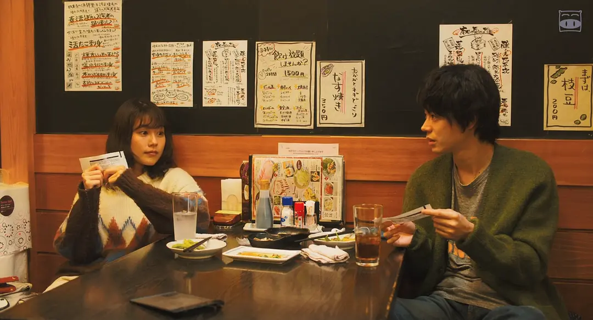
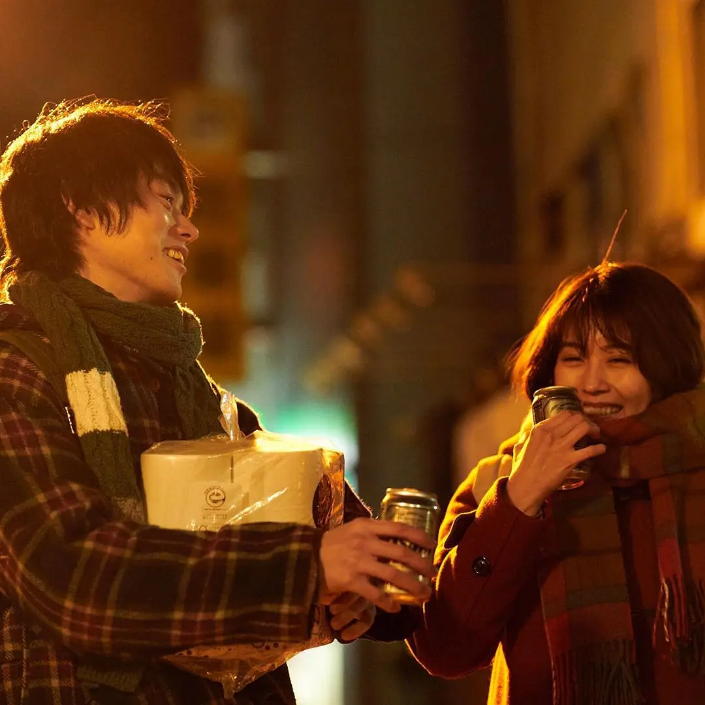
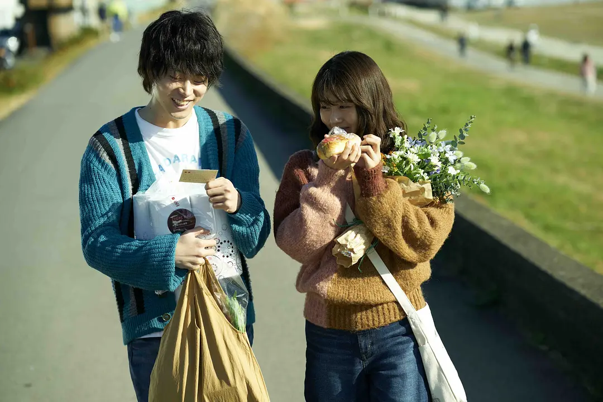
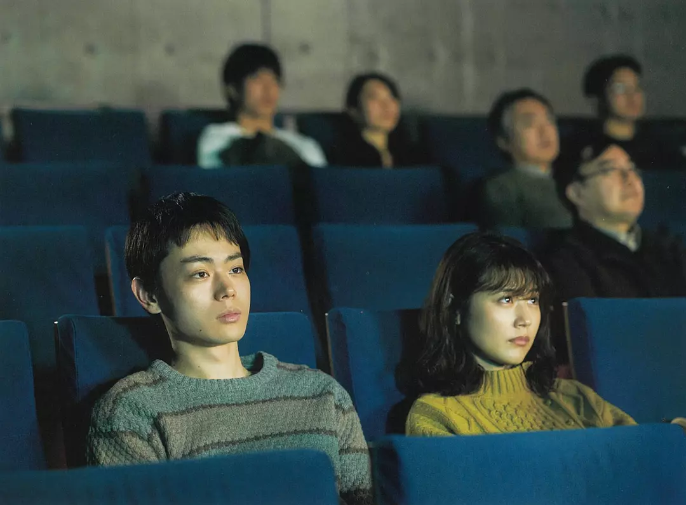
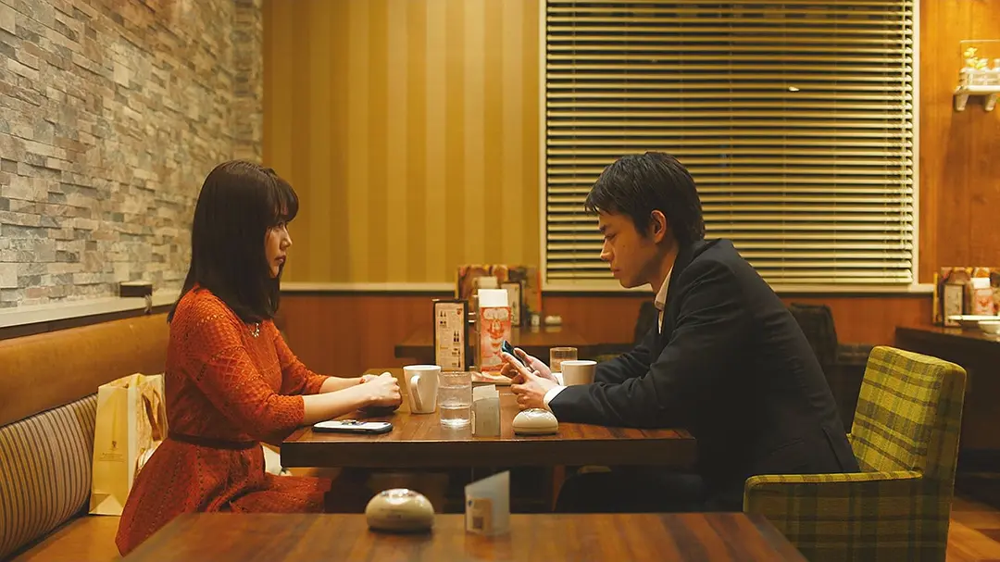
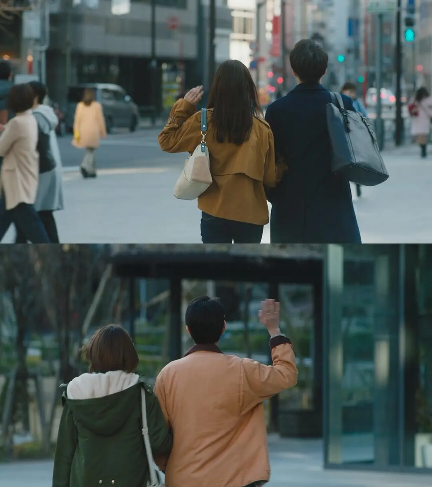

有着诸多相同的兴趣爱好的恋人

最后却以遗憾结束……

## 邂逅、同频

山音麦、八谷绢

两个错过末班地铁的大学生意外发现两人的兴趣爱好出奇的一致

两人都喜欢相同的电影、音乐和文学作品

都喜欢用电影票当书签

都好奇石头剪刀布的规则，为什么布能赢石头？明明石头能将布戳个洞

还都一起错过了同一个喜剧专场

在几次交谈中

两人互生好感

渐生情愫

## 热恋、纯粹

毕业，同居

两人在多摩川河畔的出租屋过着惬意的日子

麦以兼职插画赚钱

绢在冰淇淋店兼职

领养黑猫男爵

去老夫妇的面包房买喜欢的面包

下班后回家的三十分钟散步时间

是两人最温馨的记忆

阳台上，麦对绢说

我的人生目标就是，一直跟你过现在这样的生活。

## 现实、错位

没有坚实的物质基础的保障下

理想的乌托邦式的恋爱生活不能长久

一张插画由一千日元降到三张插画一千日元（约44RMB）

麦不得不开始找工作

绢考上了会计师证

先找到了一份朝九晚五的工作

随后几经面试

麦也入职一家初创物流公司

由此开始

生活、工作、理想不能同时兼顾

绢在下班后可以看书、打游戏，维持喜好

麦却不得不频繁加班，作策划

两人都想照顾对方的感受

但慢慢出现分歧

两双不同鞋子的特写

后备箱中扔掉的书籍

都表明两人不再同频

刚开始的两人只是想过好普通生活

最后发现并不容易

## 终焉、释然

在朋友的婚礼上

两人向各自的好友袒露心声

现在的爱情和完全不同于刚开始的模样

重回告白的地点

看见一对情侣

和当初的自己一样

热烈、纯真、充满可能

又想到当初的甜蜜和当下的遗憾

两人相拥落泪

决定分手

电影好似绝大多数情侣的真实写照

从百分百合拍到长时间消耗和平分手

本质还是没有物质保障

为了更好的生活

必须要放弃一部分

麦的理想主义最终被工作的琐碎磨灭

作为旁观者而言

多希望他能平衡好工作和生活

想了想，即使两人衣食无忧

可能也有其他插曲来干扰正常的生活节奏

我们普通人所能借鉴的

只是经营好自己的生活

借用房客中乐瑶的名言

希望我们每个人，都能做生活的高手
